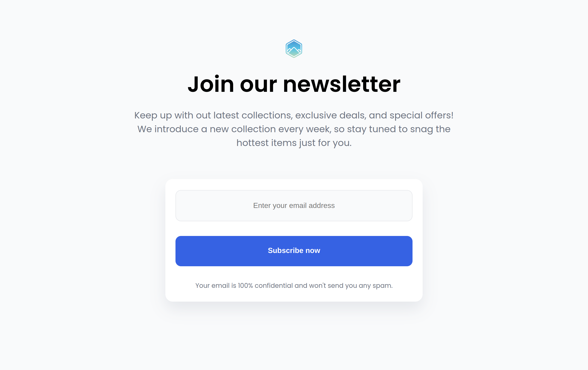

# Newsletter

This is a small project I made to train with HTML and CSS

## Table of Content

  - [Overview](#overview)
    - [Description](#description)
    - [Screenshot](#screenshot)
    - [Links](#links)
  - [My process](#my-process)
    - [Built with](#built-with)
    - [What I learned](#what-i-learned)
    - [Continued Development](#continued-development)
    - [Useful Resources](#useful-resources)
  - [Author](#author)
  - [Acknowledgments](#acknowledgments)

## Overview

### Description

I present to you a small project I made. The main objective was to work with HTML and CSS to perfect my knowledge with those technologies.
It consist of a simple newsletter subscription webpage containing a header and a main with a form to enter your email. The form is only hear for the design, it is not functional.
This project works on all device, from smartphone to desktop computer !

### Screenshot



### Links

  - [Live Site](https://sephydev.github.io/newsletter/)

## My process

### Built with

  - Semantic HTML5
  - CSS

### What I learned

Thanks to this project, I've practiced some semantic HTML, like the form, and CSS. The following snippets are some examples of the knowledges I used.

  - Semantic HTML5 (```<form>```):

```
      <form>
        <input type="email" placeholder="Enter your email address" name="email">
        <button>Subscribe now</button>
      </form>
```

  - CSS (```<button>```):
```
button {
  color: #FFFFFF;
  background-color: #3662E3;
  border: none;
  margin: 2rem auto;
}
```

### Continued Development

Seeing how form work in HTML, I will continue to master this technologie.
I will do that by using it on other project, it's a very useful html tags for professionnal website !

### Useful Resources

  - [Guide to HTML Form](https://www.w3schools.com/html/html_forms.asp)

## Author

  - Website : Sephydev

## Acknowledgment

Thanks to my friends and my family for supporting me while I journey in the land of Web Development, and during the making of this project !
